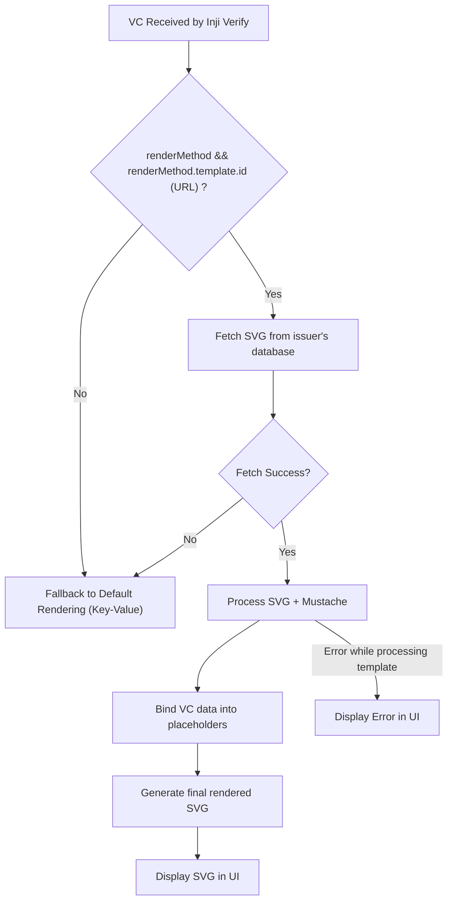

# SVG Template Rendering

Inji Verify now supports `SVG Template Rendering` based on the `W3C data model 2.0` `VC Render Method` draft specification.

## Supported Credential Formats

SVG rendering is supported for the following credential formats:
- **W3C Verifiable Credentials** (JSON-LD)

This feature allows issuers to define branded, visually rich, and layout-controlled representations of their Verifiable Credentials (VCs).

Issuers can now specify exactly how their credentials should appear when rendered by a relying party or wallet.

---

# Why SVG Template Rendering?

By default, credentials are displayed using a standard key–value UI.

However, many issuers prefer a custom-designed layout, such as:

- Certificate-style visual designs
- Identity cards, membership badges, licenses
- Custom colours, branding, logos
- Positioned text, icons, borders, frames
- A fixed ordering of fields

To support such visual customization, the VC can include a `renderMethod` section pointing to an `SVG template` (often with `Mustache` placeholders).

---

# W3C Render Method Specification Support

- Inji Verify follows the W3C VC Render Method proposal, which introduces a dedicated property in the VC.

- Issuers can embed a `renderMethod` object inside the credential.

- The issuer must host and maintain the `SVG template` on their server or template store.

**_Example Of RenderMethod_**

```json
"renderMethod": [
    {
      "type": "TemplateRenderMethod",
      "renderSuite": "svg-mustache",
      "template": {
        "id": "https://issuer.example.org/render/membership-card-template.svg",
        "mediaType": "image/svg+xml"
      }
    }
  ]
```

**_Example Credential with RenderMethod_**

```json
{
  "@context": ["https://www.w3.org/ns/credentials/v2"],
  "type": ["VerifiableCredential", "MembershipCard"],
  "issuer": "https://issuer.example.org",
  "credentialSubject": {
    "id": "did:example:123",
    "name": "SVG VC Example",
    "memberSince": "2023-01-01"
  },
  "renderMethod": [
    {
      "type": "TemplateRenderMethod",
      "renderSuite": "svg-mustache",
      "template": {
        "id": "https://issuer.example.org/render/membership-card-template.svg",
        "mediaType": "image/svg+xml"
      }
    }
  ]
}
```

## Each Render Method entry describes:

| Field        | Meaning                                                                                 |
|--------------|-----------------------------------------------------------------------------------------|
| type         | Rendering method type (e.g., `TemplateRenderMethod`)                                    |
| renderSuite  | Defines rendering engine (e.g., `svg-mustache`)                                         |
| id           | URL pointing to where the SVG template is hosted                                        |
| mediaType    | Specifies format (`image/svg+xml`)                                                      |


## Common Media Types Supported

| MediaType          | Usage                                      |
|--------------------|---------------------------------------------|
| image/svg+xml      | SVG templates (commonly used with Mustache) |

## What svg-mustache Means

`svg-mustache` is a renderSuite that instructs the verifier:

- “Render this credential using an SVG template that contains Mustache-style placeholders.”

### Components

| Part     | Meaning                                                                                         |
|----------|-------------------------------------------------------------------------------------------------|
| SVG      | The template is an SVG graphic (cards, certificates, identity badges).                          |
| Mustache | Template variables like `{{/credentialSubject/fullName}}` are replaced with actual VC data.          |

# Functionalities 

## How Inji Verify Renders SVG Templates

When a credential is ready to be displayed, Inji Verify performs the following steps:

- Inji Verify UI fetches the submission result through APIs, validates it using `vc-verifier`, and returns the response

- Inji Verify UI renders the response accordingly:

1. For `ldp_vc` → Render directly

   - If the verified credential includes a `renderMethod` with an `SVG template` reference, Inji Verify fetches the `SVG template` from the issuer, preprocesses the VC for language and placeholder handling, and renders the credential in SVG format using the VCRenderer. The sanitized SVG is then displayed in the interface.

   - If SVG template rendering fails for any reason (missing template, fetch failure, invalid SVG, rendering error, or empty output), Inji Verify automatically falls back to showing the credential in the standard key–value layout using its default UI components.

   - This ensures that credential display is always reliable—using SVG rendering and falling back to the structured key–value view when SVG is unavailable.

3. Or shows error messages and failure details if the verification failed.



---

> **_Important Notes_** : 
> - `renderMethod` is not part of `cryptographic proof`.
> - Changing the template does not break signatures.
> - If the issuer's template becomes unavailable, Inji Verify gracefully falls back to default rendering.
> - `SD-JWT` credentials do not support renderMethod